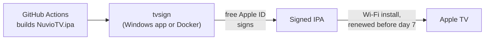

<picture>
  <source media="(prefers-color-scheme: dark)" srcset=".github/assets/nuviotv-dark.svg">
  
</picture>

  
  
  
  

Native Apple TV (tvOS 26+) version of [Nuvio](https://github.com/NuvioMedia/NuvioMobile): a media hub built on the Stremio add-on ecosystem, with a SwiftUI interface designed for the Siri Remote and a shared Kotlin Multiplatform core.

> **Unofficial community port.** This project is not affiliated with the Nuvio team. Please report NuvioTV bugs here, not upstream.

## Install

NuvioTV is not on the App Store. It is sideloaded with a free Apple ID and kept installed by **tvsign**, which signs the app and reinstalls it on your Apple TV before the 7-day free-account limit:

- **Windows:** tvsign desktop app (installer, starts with Windows).
- **NAS / Raspberry Pi / home server:** tvsign Docker image, running 24/7.

Each release on the [Releases](../../releases) page carries an unsigned `NuvioTV.ipa` built by GitHub Actions.

Requirements: Apple TV 4K (any generation) or Apple TV HD on tvOS 26 or later, on the same local network as the machine running tvsign.

## What differs from upstream

- Native SwiftUI tvOS app (`iosApp/NuvioTV`) using the system sidebar, search, focus effects and transport bar.
- Two playback engines: AVPlayer for files tvOS plays natively (HDR, Dolby Vision, frame-rate matching) and mpv for everything else.
- Siri Remote handling: layered Back, swipe scrubbing, ±10 s clicks, hold to fast-forward, Up Next.
- Audio and subtitle language preferences remembered per show, with readable track names.
- Full French localization.

## Building

The app builds off-Mac on GitHub Actions (`.github/workflows/tvos-device-ipa.yml`). With a Mac and Xcode 26+, open `iosApp/iosApp.xcodeproj` and build the `NuvioTV` scheme; the shared Kotlin framework is built by Gradle during the Xcode build.

## Credits and license

- [Nuvio](https://github.com/NuvioMedia/NuvioMobile) by the Nuvio team: the app, shared core and brand.
- [youngchris29-art](https://github.com/youngchris29-art/NuvioMobile): original native tvOS port this project continues.
- [MPVKit](https://github.com/mpvkit/MPVKit) and mpv for the playback engine.

Licensed under the GNU General Public License v3.0, like upstream Nuvio. See [LICENSE](LICENSE). The upstream README is kept in [README.upstream.md](README.upstream.md).
